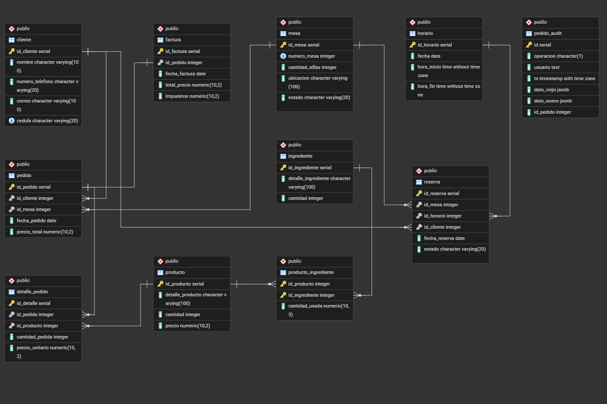
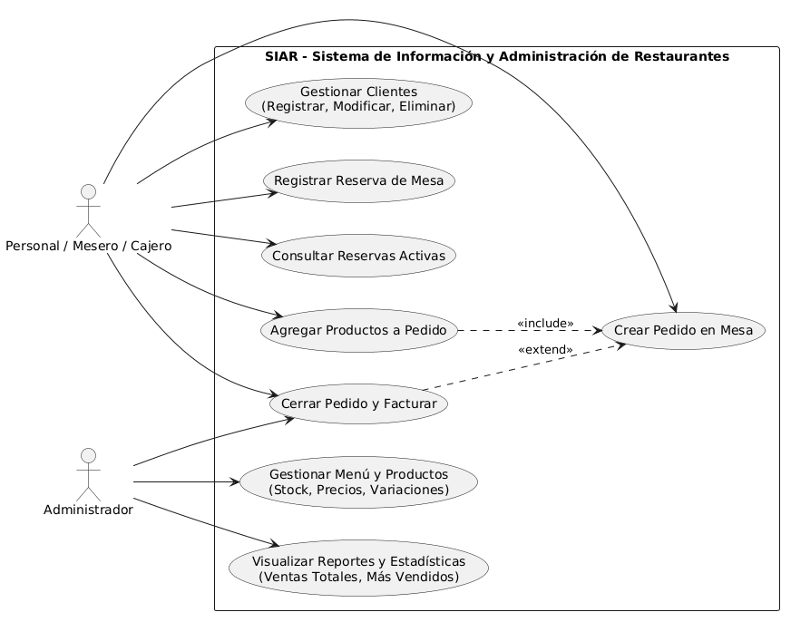

# Sistema de Gestión de Restaurante (SIAR)

## 1. Descripción del Sistema
SIAR es un sistema de información diseñado para la gestión integral de un restaurante, optimizando el flujo de trabajo operativo. Permite a los meseros, cajeros y administradores gestionar clientes, productos, reservas de mesas y el ciclo de vida completo de un pedido, garantizando la consistencia de los datos mediante lógica avanzada de base de datos.

## 2. Requerimientos Funcionales
El sistema cumple con las siguientes funcionalidades principales propias del dominio del restaurante:
* **Gestión de Menú y Clientes:** Permite registrar, actualizar, listar y eliminar productos del menú y clientes frecuentes.
* **Toma de Pedidos:** Creación de pedidos asociados a clientes y mesas, permitiendo agregar múltiples productos al detalle del pedido.
* **Validación Automática de Inventario:** Verifica automáticamente que existan unidades disponibles antes de agregar un producto a un pedido (vía Trigger).
* **Cálculo Automático de Totales:** Actualiza de forma dinámica el monto total del pedido cada vez que se inserta o modifica un producto en el detalle (vía Trigger).
* **Cierre y Facturación Segura:** Permite cerrar un pedido y generar su factura correspondiente operando bajo transacciones para evitar inconsistencias de datos.
* **Reportes Analíticos:** Generación de reportes como productos más vendidos y ventas totales agrupadas por fecha (vía Vistas).

## 3. Instalación y Configuración
Sigue estos pasos para clonar, configurar y ejecutar el proyecto en tu entorno local:

### 3.1. Prerrequisitos
* Python 3.10 o superior.
* PostgreSQL 14 o superior.

### 3.2. Configuración del Entorno
1. Clona este repositorio.
   `git clone https://github.com/Sofiaflorezz/SIAR-BD-Avanzadas.git`
2. Crea un entorno virtual en la raíz del proyecto:
   `python -m venv venv`
3. Activa el entorno virtual:
   * Windows: `venv\Scripts\activate`
   * Linux/Mac: `source venv/bin/activate`
4. Instala las dependencias:
   `pip install -r requirements.txt`
5. Crea un archivo `.env` en la raíz (junto a `run.py`) con las siguientes variables para la conexión a PostgreSQL:
   ```env
   DB_HOST=localhost
   DB_PORT=5432
   DB_NAME=siar_db
   DB_USER=tu_usuario
   DB_PASSWORD=tu_contraseña

### 3.3 Configuración de la Base de Datos
Antes de ejecutar la API, debes inicializar la base de datos `siar_db`  y ejecutar los scripts SQL ubicados en la carpeta `database/` en el siguiente orden:

1. `schema/`: Creación de tablas, llaves primarias, foráneas e índices.
2. `views/`: Creación de vistas analíticas.
3. `procedures/`: Lógica de negocio (funciones y procedimientos).
4. `triggers/`: Disparadores de validación y cálculo.
5. `subqueries/`: Scripts de consultas complejas de prueba.

### 3.4 Ejecución
Para levantar el servidor de desarrollo de Flask:
`python run.py`
La API estará disponible en `http://localhost:5000`.

## 4. Diagramas

### 4.1 Diagrama Relacional



### 4.2 Diagrama de casos de uso



## 5. Endpoints principales

La API REST expone los siguientes endpoints, estructurados por dominio:

| Método | URL | Descripción |
|-|-|-|
| **GET** | `/clientes` | Obtiene el listado de todos los clientes. |
| **POST** | `/clientes` | Crea un nuevo registro de cliente. |
| **GET** | `/clientes/<id>` | Obtiene los detalles de un cliente específico. |
| **PUT** | `/clientes/<id>` | Actualiza la información de un cliente existente. |
| **DELETE** | `/clientes/<id>` | Elimina un cliente del sistema. |
| **GET** | `/productos` | Lista todos los productos disponibles en el menú. |
| **POST** | `/productos` | Registra un nuevo producto. |
| **PUT** | `/productos/<id>` | Modifica los datos (precio, stock) de un producto. |
| **DELETE** | `/productos/<id>` | Elimina un producto del catálogo. |
| **POST** | `/pedidos` | Crea un nuevo pedido asociado a un cliente/mesa. |
| **GET** | `/pedidos` | Obtiene el historial de pedidos. |
| **GET** | `/pedidos/<id>` | Obtiene el detalle de un pedido específico. |
| **POST** | `/pedidos/<id>/productos` | Agrega un producto (detalle) a un pedido existente. |
| **PUT** | `/pedidos/<id>/cerrar` | Ejecuta el procedimiento para cerrar un pedido. |
| **POST** | `/pedidos/<id>/facturar` | Cierra el pedido y genera la factura asociada. |

## 6. Mapeo de Requerimientos Técnicos

Para facilitar la revisión del proyecto, a continuación se detalla cómo se cumplen los requerimientos avanzados de bases de datos:

1. R1 - BD Relacional: Se implementaron 10 tablas interconectadas (`cliente`, `mesa`, `reserva`, `producto`, `ingrediente`, `pedido`, `detalle_pedido`, `factura`, etc.) con sus respectivas restricciones.
2. R2 - CRUD Completo: Implementado al 100% en las entidades principales Cliente y Producto mediante los métodos GET, POST, PUT y DELETE.
3. R3 - Procedimientos Almacenados: Implementación de `cerrar_pedido()`, `registrar_reserva()` y `registrar_pedido()` que encapsulan la lógica transaccional del negocio.
4. R4 - Triggers: Implementación de `trg_validar_stock` (validación de reglas de negocio BEFORE INSERT), `trg_actualizar_total` (cálculo automático de montos AFTER INSERT/UPDATE) y `trg_audit_pedido` (auditoría completa de operaciones INSERT/UPDATE/DELETE sobre la tabla pedido).
5. R5 - Subconsultas: Implementado en la lógica de filtrado avanzado, como la búsqueda de pedidos específicos que superan ciertos montos (`SELECT * FROM pedido WHERE total > ( )`).
6. R6 - Vistas: Creación de reservas_activas, productos_mas_vendidos y ventas_totales para simplificar reportes analíticos complejos.
7. R7 - Índices: Creación de índices estratégicos (`idx_cliente_cedula`, `idx_producto_nombre`, `idx_pedido_fecha`, `idx_reserva_fecha`) para optimizar el rendimiento de las consultas más frecuentes en la API.
8. R8 - Transacciones: Uso de bloques `BEGIN; ... COMMIT;` explícitos en operaciones críticas como la creación y cierre secuencial de pedidos para garantizar atomicidad.

## 7. Integrantes del grupo

* Carmen Sofia Florez Juajibioy
* Angelo Alejandro Ibañez Hernandez
* Jefferson David Ortiz Buitrago
